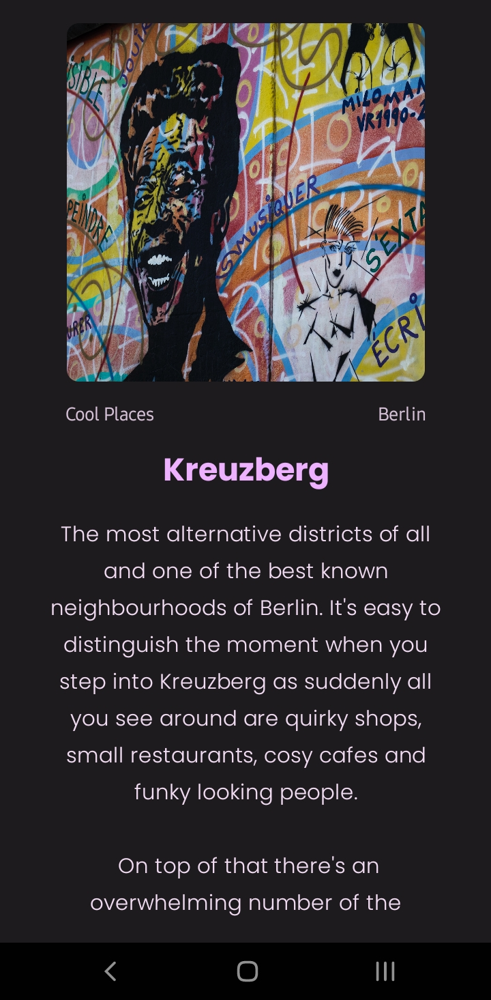

# BerlinApp
BerlinApp represents a significant accomplishment as my most substantial project as of 07/2023. It serves as an app that guides users through exploring Berlin's landmarks, cool spots, cafes, bars, and more, providing concise information about each location. 

Developing the app took approximately one week, and the most challenging aspect was implementing the navigation logic. For optimal user experience, I decided to utilize BackHandler instead of NavController to ensure precise page transitions with each click. 

One of the project's key strengths is its full responsiveness, seamlessly adapting to various devices, including mobile screens, foldables, and tablets.

    
    
    
    

|  |  |      | 

